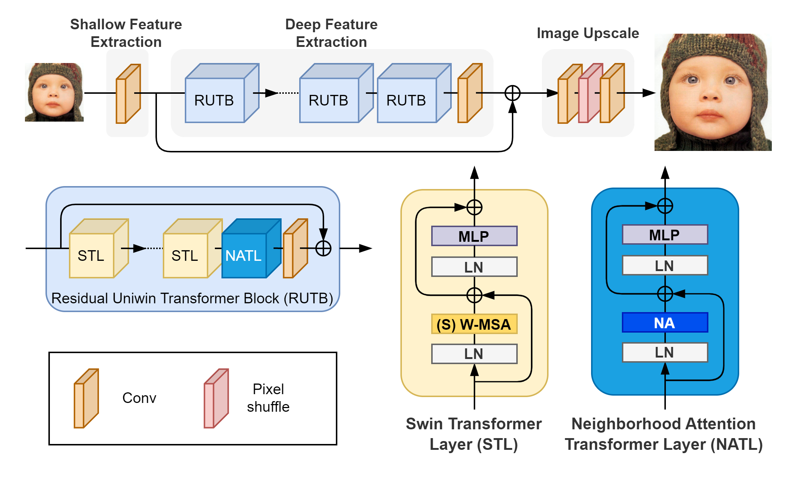
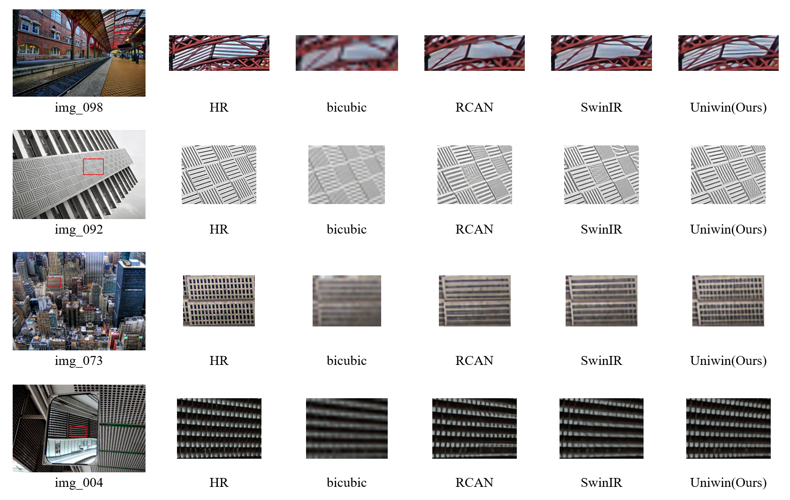

# Image Super-Resolution with Unified Window Attention


## Architecture

## Results



## Environment
- _Ubuntu 20.04 LTS_
- 8 _NVIDIA RTX A5000_

### Install
```
pip3 install -r requirements.txt
```

## Preparation
- Download ImageNet

## Training

### To pretrain with ImageNet

```
python3 -m torch.distributed.launch --nproc_per_node=4 train.py --opt options/train_Uniwin_SRx2_ImageNet_from_scratch.json --dist True

python3 -m torch.distributed.launch --nproc_per_node=4 train.py --opt options/train_Uniwin_SRx3_ImageNet_from_scratch.json --dist True

python3 -m torch.distributed.launch --nproc_per_node=4 train.py --opt options/train_Uniwin_SRx4_ImageNet_from_scratch.json --dist True

```
### To finetune with DF2K
```
python3 -m torch.distributed.launch --nproc_per_node=4 train.py --opt options/train_Uniwin_SRx2_finetune_from_ImageNet_pretrain.json --dist True

python3 -m torch.distributed.launch --nproc_per_node=4 train.py --opt options/train_Uniwin_SRx4_finetune_from_ImageNet_pretrain.json --dist True

python3 -m torch.distributed.launch --nproc_per_node=4 train.py --opt options/train_Uniwin_SRx4_finetune_from_ImageNet_pretrain.json --dist True
```

### To train from scratch with DF2K
```
python3 -m torch.distributed.launch --nproc_per_node=4 train.py --opt options/train_Uniwin_SRx2_DF2K_from_scratch.json --dist True

python3 -m torch.distributed.launch --nproc_per_node=4 train.py --opt options/train_Uniwin_SRx3_DF2K_from_scratch.json --dist True

python3 -m torch.distributed.launch --nproc_per_node=4 train.py --opt options/train_Uniwin_SRx4_DF2K_from_scratch.json --dist True
```
