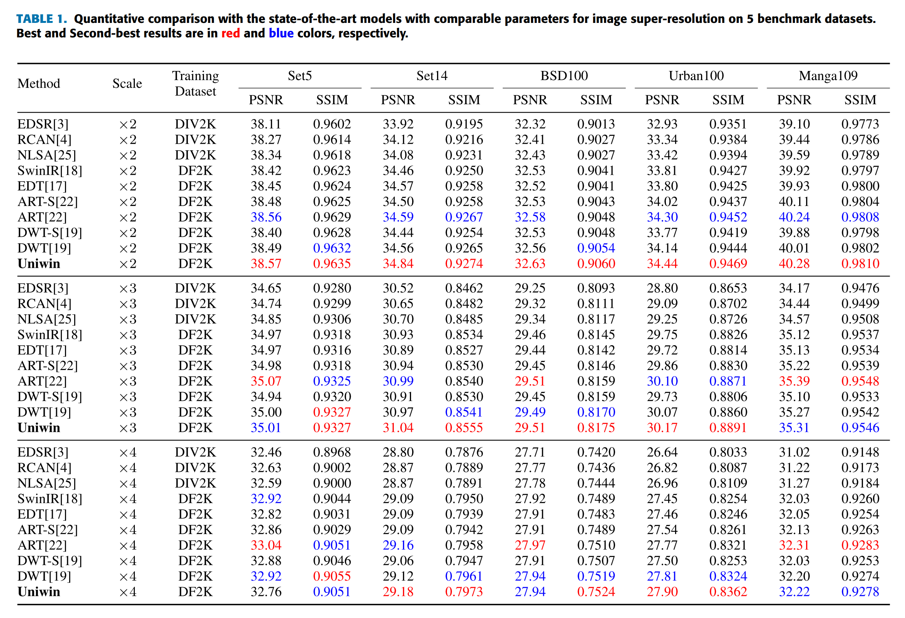
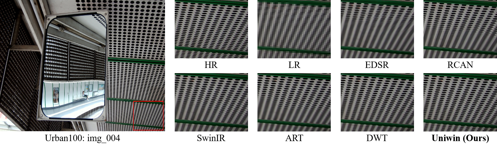

# Image Super-Resolution with Unified Window Attention

## Architecture

## Results
<details>
<summary>Quantitative Results</summary>
<p align="center">
  
  
  
</p>
</details>

<details>
<summary>Qualitative Results</summary>
<p align="center">
  
  
  
  
  
  
  
  
    
</p>
</details>

<details>
<summary>Ablations</summary>
<p align="center">
  
  
  
  
</p>
</details>


## Environment
- _Ubuntu 20.04 LTS_
- 4 _NVIDIA RTX A5000_

### Install
```
pip3 install -r requirements.txt
```

## Preparation
- Download training dataset (DF2K/ImageNet)
- Download test dataset (Set5/Set14/BSD100/Urban100/Manga109)

## Training

### To pretrain with ImageNet data (x2/x3/x4)

```
torchrun --standalone --nproc_per_node=4 train.py --opt options/train_Uniwin_SRx2_ImageNet_from_scratch.json

torchrun --standalone --nproc_per_node=4 train.py --opt options/train_Uniwin_SRx3_ImageNet_from_scratch.json

torchrun --standalone --nproc_per_node=4 train.py --opt options/train_Uniwin_SRx4_ImageNet_from_scratch.json

```
### To finetune with DF2K data (x2/x3/x4)
```
torchrun --standalone --nproc_per_node=4 train.py --opt options/train_Uniwin_SRx2_finetune_from_ImageNet_pretrain.json

torchrun --standalone --nproc_per_node=4 train.py --opt options/train_Uniwin_SRx3_finetune_from_ImageNet_pretrain.json

torchrun --standalone --nproc_per_node=4 train.py --opt options/train_Uniwin_SRx4_finetune_from_ImageNet_pretrain.json
```

### To finetune from SRx2 (x3/x4)
```
torchrun --standalone --nproc_per_node=4 train.py --opt options/train_Uniwin_SRx3_finetune_from_SRx2.json

torchrun --standalone --nproc_per_node=4 train.py --opt options/train_Uniwin_SRx4_finetune_from_SRx2.json
```

### To train from scratch with DF2K (x2/x3/x4)
```
torchrun --standalone --nproc_per_node=4 train.py --opt options/train_Uniwin_SRx2_DF2K_from_scratch.json

torchrun --standalone --nproc_per_node=4 train.py --opt options/train_Uniwin_SRx2_DF2K_from_scratch.json

torchrun --standalone --nproc_per_node=4 train.py --opt options/train_Uniwin_SRx2_DF2K_from_scratch.json
```
